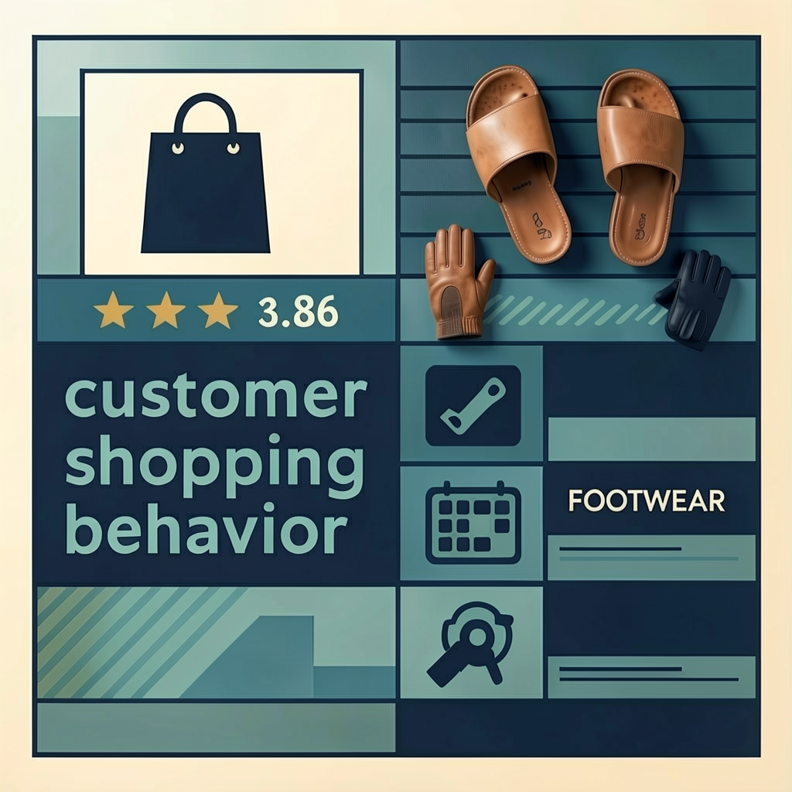

# customer_behavior_analysis
An end-to-end analytics project combining SQL, Python, and Power BI to uncover customer insights, perform segmentation, and deliver a business-focused dashboard.

  

## 📌 Project Overview
This project simulates a real-world data analytics workflow, transforming raw transaction data into actionable business insights.

Using **Python, SQL Server, and Power BI**, I analyzed ~3,900 customer transactions to understand:
- Customer behavior and spending patterns  
- Product performance across categories  
- Opportunities to improve retention and revenue  

---

## ⚙️ Tools & Technologies
- **Python (Pandas)** - data cleaning & feature engineering  
- **SQL Server (T-SQL)** - data storage & business analysis  
- **JupyterLab** - interactive analysis  
- **Power BI** - dashboard & data visualization  

---

## 🔄 Project Workflow

1. **Data Preparation (Python)**
   - Cleaned missing values and standardized dataset
   - Created new features such as `age_group` and purchase frequency

2. **Data Analysis (SQL)**
   - Loaded data into SQL Server
   - Answered key business questions using:
     - CASE statements
     - CTEs
     - Window functions

3. **Visualization (Power BI)**
   - Built an interactive dashboard
   - Enabled filtering by category, subscription status, and shipping type

---

## 📊 Key Insights

- 💰 **Revenue Distribution**  
  Male customers generate **68% of total revenue**, while female customers have slightly higher average spend per transaction  

- 🎯 **High-Value Customers**  
  Customers using discounts still spend above average → not purely price-sensitive  

- ⭐ **Top Performing Products**  
  Accessories and footwear categories lead in customer satisfaction  

- 🔁 **Customer Loyalty**  
  ~80% of customers are repeat buyers → strong retention but limited new acquisition  

- 🚀 **Business Opportunity**  
  Over **2,500 repeat customers are not subscribed**, representing a major conversion opportunity  

---

## 📈 Dashboard Preview

  

